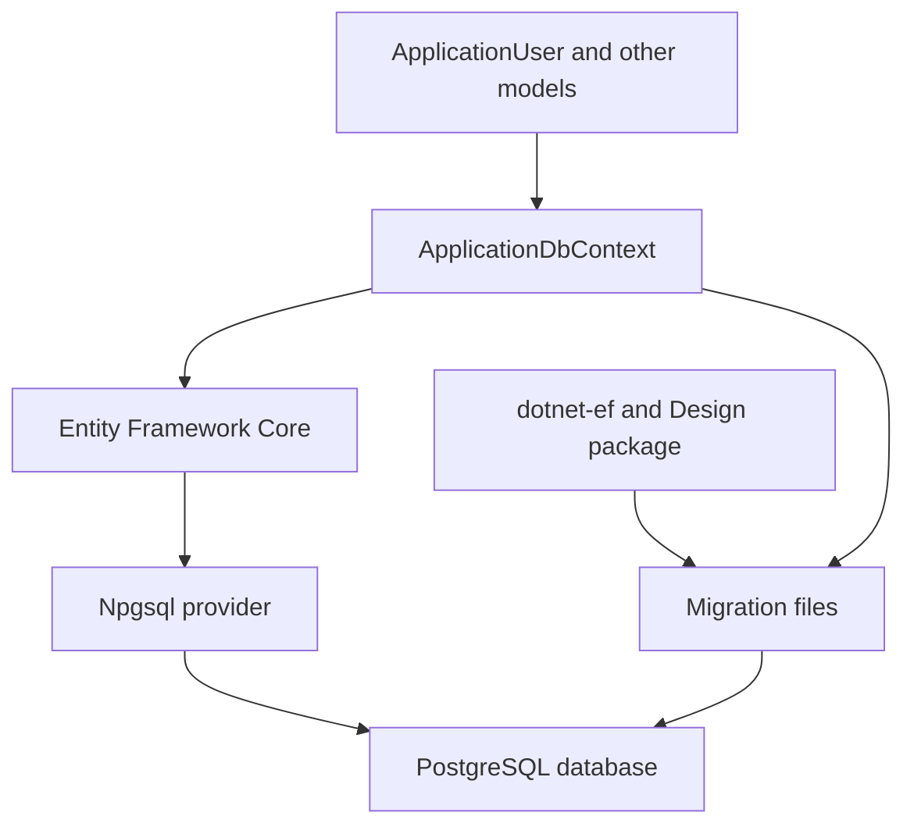

## Entity Framework Core and PostgreSQL Setup

### What We Set Up

We prepared the `DevConnect.Api` project to use Entity Framework Core with PostgreSQL.

The setup included:

* Creating or restoring `DevConnect.Api.csproj`.
* Creating `ApplicationUser` for application users.
* Creating `ApplicationDbContext` to manage database entities.
* Registering `ApplicationDbContext` in `Program.cs`.
* Adding the required Entity Framework and PostgreSQL packages.
* Preparing the project to generate its first migration.

The `.csproj.user` file was not used because it only stores personal Visual Studio settings. The actual `.csproj` file defines how the API is built and which packages it uses.

### Main Components

#### `ApplicationUser`

`ApplicationUser` represents a user in DevConnect.

```csharp
public class ApplicationUser : IdentityUser
{
}
```

It inherits standard Identity properties such as:

* User ID
* Username
* Email
* Password hash
* Authentication and security information

Additional DevConnect-specific properties can be added later.

#### `ApplicationDbContext`

`ApplicationDbContext` connects the application models to Entity Framework Core.

```csharp
public class ApplicationDbContext
    : IdentityDbContext<ApplicationUser>
{
    public ApplicationDbContext(
        DbContextOptions<ApplicationDbContext> options)
        : base(options)
    {
    }
}
```

It is responsible for:

* Tracking application entities.
* Defining relationships between entities.
* Converting C# models into database tables.
* Providing database access to the application.
* Including ASP.NET Core Identity tables.

Future entities such as `Post`, `Comment` and `Like` will also be managed through this context.

### Required Packages

| Package/tool                                        | Purpose                                                                  |
| --------------------------------------------------- | ------------------------------------------------------------------------ |
| `Microsoft.EntityFrameworkCore.Design`              | Allows EF tools to inspect the models and generate migrations.           |
| `Npgsql.EntityFrameworkCore.PostgreSQL`             | Allows Entity Framework Core to communicate with PostgreSQL.             |
| `Microsoft.AspNetCore.Identity.EntityFrameworkCore` | Connects ASP.NET Core Identity users and roles to Entity Framework Core. |
| `dotnet-ef`                                         | Command-line tool used to create, inspect and apply migrations.          |

`dotnet-ef` is a development tool, while the other packages are dependencies recorded in `DevConnect.Api.csproj`.

### How the Components Relate



The relationship works as follows:

1. C# classes describe users, posts and other application data.
2. `ApplicationDbContext` collects these classes into one database model.
3. Entity Framework Core manages and tracks the model.
4. Npgsql translates Entity Framework operations into PostgreSQL commands.
5. PostgreSQL stores the actual data.
6. `dotnet-ef` and the Design package inspect the context and generate migration files.
7. Migrations describe how the PostgreSQL database structure must change.

### Registration in `Program.cs`

The context is registered through dependency injection:

```csharp
builder.Services.AddDbContext<ApplicationDbContext>(options =>
    options.UseNpgsql(
        builder.Configuration.GetConnectionString("DefaultConnection")));
```

This tells the application:

* Use `ApplicationDbContext` for database operations.
* Use PostgreSQL as the database provider.
* Read the database address and credentials from `DefaultConnection`.

### Entity Framework Migrations

A migration is a generated record of database structure changes.

The first migration is generated with:

```powershell
dotnet ef migrations add InitialCreate --project ".\backend\DevConnect.Api\DevConnect.Api.csproj" --startup-project ".\backend\DevConnect.Api\DevConnect.Api.csproj" --context ApplicationDbContext --output-dir Migrations
```

Entity Framework automatically creates:

```text
backend/DevConnect.Api/Migrations/
```

Migration files should not be created manually because EF generates them by comparing the current C# model with its previous model snapshot.

Generating a migration does not immediately modify the database. Applying it is a separate step:

```powershell
dotnet ef database update
```

Before generating a migration, the project must build successfully and EF must be able to discover `ApplicationDbContext`.
