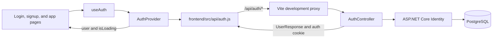
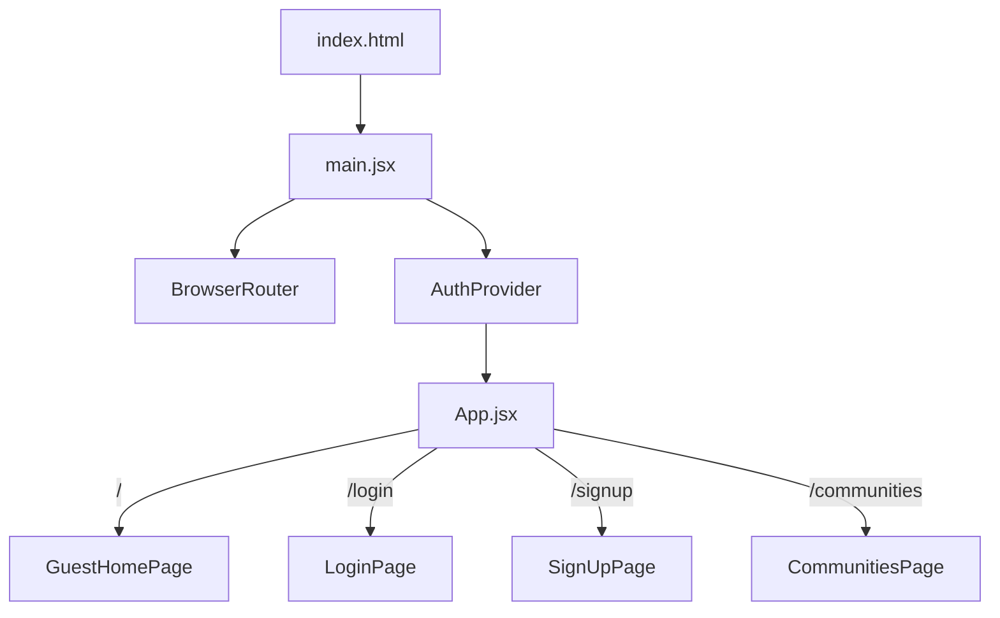
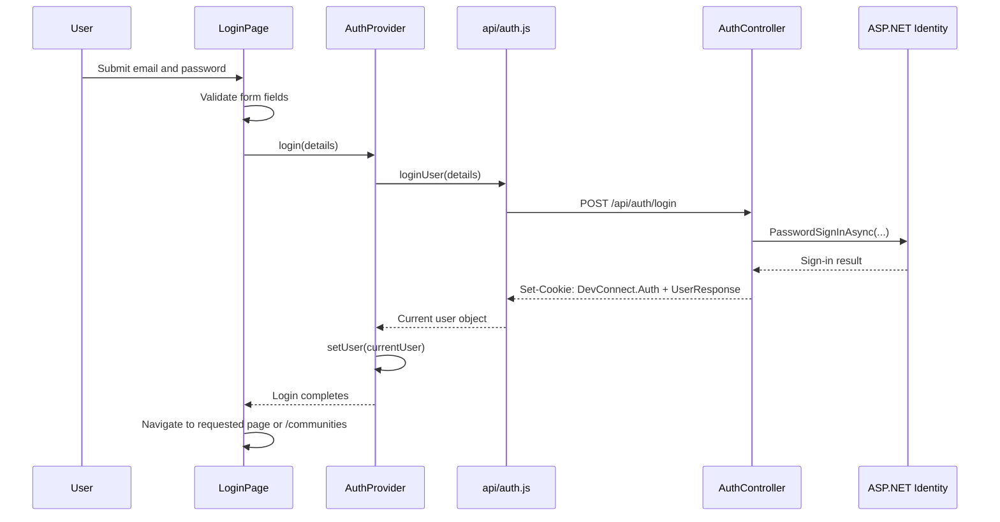

# Authentication and Home Page Flow

This document explains how authentication moves through DevConnect and how the shared user state changes the main page. It describes the current implementation rather than the separate HTML mockups in `design/`.

## System overview

DevConnect uses cookie authentication:

1. React sends login, registration, session, and logout requests through the frontend auth API module.
2. ASP.NET Core Identity validates the request and creates or removes the `DevConnect.Auth` cookie.
3. `AuthProvider` stores the returned user in React state.
4. Components call `useAuth()` and render either guest or signed-in controls from that shared state.

## Application entry and routing

| File | Responsibility | Connects to |
| --- | --- | --- |
| [`frontend/index.html`](../frontend/index.html) | Provides the DOM element where React mounts. | `src/main.jsx` through Vite. |
| [`frontend/src/main.jsx`](../frontend/src/main.jsx) | Creates the React application. It wraps the route tree in `BrowserRouter` and `AuthProvider`. | `App.jsx`, `AuthContext.jsx`. |
| [`frontend/src/App.jsx`](../frontend/src/App.jsx) | Maps URLs to pages. | `/` → `GuestHomePage`, `/login` → `LoginPage`, `/signup` → `SignUpPage`, `/communities` → `CommunitiesPage`. |
| [`frontend/vite.config.js`](../frontend/vite.config.js) | Proxies browser requests beginning with `/api` to `https://localhost:7201` during frontend development. | React API client → ASP.NET backend. |

Despite its name, `GuestHomePage` is the main page for both guests and signed-in users. There is currently no separate member-home route. The page changes its content by reading `user` and `isLoading` from the auth context.

## Frontend authentication files

### `frontend/src/api/auth.js`

This is the only frontend module that communicates with the authentication endpoints. Its shared `sendAuthRequest()` function:

- prefixes requests with `/api/auth/`;
- sends `credentials: 'include'` so the browser includes the authentication cookie;
- sends and reads JSON;
- converts backend validation or authentication responses into JavaScript `Error` objects.

The exported functions map directly to backend actions:

| Frontend function | HTTP request | Backend action |
| --- | --- | --- |
| `registerUser(details)` | `POST /api/auth/register` | `AuthController.Register` |
| `loginUser(details)` | `POST /api/auth/login` | `AuthController.Login` |
| `getCurrentUser()` | `GET /api/auth/me` | `AuthController.Me` |
| `logoutUser()` | `POST /api/auth/logout` | `AuthController.Logout` |

### `frontend/src/context/useAuth.js`

This file defines the React `AuthContext` and exports the `useAuth()` hook. The hook lets components read the context without importing the context object directly. It also throws a clear error if a component is rendered outside `AuthProvider`.

### `frontend/src/context/AuthContext.jsx`

`AuthProvider` owns the client-side session state:

- `user` is the current `UserResponse`, or `null` for a guest.
- `isLoading` is `true` while the initial session check is running.
- `login(details)` calls `loginUser()`, then stores the returned user.
- `register(details)` calls `registerUser()`, then stores the returned user.
- `logout()` calls `logoutUser()`, then clears the user.

On application startup, its effect calls `getCurrentUser()`. A successful response restores the user after a refresh. A `401` or other failure leaves `user` as `null`. In both cases, `isLoading` becomes `false` when the request finishes.

Keeping this state in one provider is what makes the header and current page update immediately after login or logout without a full page reload.

## Login flow

[`frontend/src/pages/LoginPage.jsx`](../frontend/src/pages/LoginPage.jsx) validates the form and calls `login()` from `useAuth()`. After a successful login it navigates back to the route stored by `ProtectedRoute`, if present; otherwise it navigates to `/communities`.

The equivalent registration path starts in [`frontend/src/pages/SignUpPage.jsx`](../frontend/src/pages/SignUpPage.jsx), calls `register()`, and navigates to `/communities`. The backend registration action also signs in the new user, so no second login request is required.

## Session restoration after refresh

1. [`main.jsx`](../frontend/src/main.jsx) mounts `AuthProvider` around the route tree.
2. `AuthProvider` starts with `user = null` and `isLoading = true`.
3. It calls `GET /api/auth/me` through `getCurrentUser()`.
4. The browser sends `DevConnect.Auth` because the request uses `credentials: 'include'`.
5. `AuthController.Me` uses the authenticated request principal to load the Identity user.
6. The response becomes the context `user`; otherwise the provider keeps `user` as `null`.
7. Auth-aware components re-render after `isLoading` becomes `false`.

Components should check `isLoading` before displaying guest controls. Otherwise, login buttons can briefly flash while the session request is still in progress.

## How the main page responds to authentication

[`frontend/src/pages/GuestHomePage.jsx`](../frontend/src/pages/GuestHomePage.jsx) calls `useAuth()` and reads both `user` and `isLoading`.

| State | Main-page behavior |
| --- | --- |
| Session loading | Neither the guest join card nor the member card is shown yet. |
| Guest (`!user`) | Shows “Create account” and “Log in”, the “Join a discussion” guest action, and the sign-in benefit panel. |
| Signed in (`user`) | Replaces the join card with a welcome card using `fullName`, `userName`, or `email`, and links to `/communities`. Guest-only prompts and marketing panels are hidden. |

The final guard on `AuthenticationPrompt` is `Boolean(promptAction) && !user`. This ensures that a stale prompt state cannot display a login dialog after the user becomes authenticated.

[`frontend/src/components/AppHeader.jsx`](../frontend/src/components/AppHeader.jsx) independently reads the same context:

- guests see “Log in” and “Sign up”;
- signed-in users see their name and “Log out”;
- no auth controls are shown while the session is loading.

Both desktop and mobile header controls use the same `user` value. The page and header do not pass user data to each other; they stay synchronized because both subscribe to `AuthProvider`.

[`frontend/src/components/AuthenticationPrompt.jsx`](../frontend/src/components/AuthenticationPrompt.jsx) is presentational. It does not know whether the user is authenticated. Its parent decides whether `open` can be true. This pattern is also used by the communities page.

## Communities and protected content

[`frontend/src/pages/CommunitiesPage.jsx`](../frontend/src/pages/CommunitiesPage.jsx) is a public route with auth-aware interactions:

- anyone can browse the directory;
- guests attempting to open “Joined” or join a community see `AuthenticationPrompt`;
- signed-in users do not see that prompt.

[`frontend/src/components/ProtectedRoute.jsx`](../frontend/src/components/ProtectedRoute.jsx) can protect a whole route. It waits for session loading, redirects guests to `/login`, and records the original location so `LoginPage` can return there afterward.

`ProtectedRoute` is currently not used by any route in `App.jsx`. It should only be wrapped around a route that must be completely unavailable to guests; public pages with individual member-only actions should continue using auth-aware controls instead.

## Backend authentication files

| File | Responsibility | Connects to |
| --- | --- | --- |
| [`backend/DevConnect.Api/Program.cs`](../backend/DevConnect.Api/Program.cs) | Registers controllers, EF Core, ASP.NET Identity, authorization, and cookie settings. Builds the HTTP pipeline in authentication-before-authorization order. | Controller, database context, Identity stores. |
| [`backend/DevConnect.Api/Controllers/AuthController.cs`](../backend/DevConnect.Api/Controllers/AuthController.cs) | Implements register, login, logout, and current-user endpoints. | Request/response contracts, `UserManager`, `SignInManager`. |
| [`backend/DevConnect.Api/Contracts/Auth/LoginRequest.cs`](../backend/DevConnect.Api/Contracts/Auth/LoginRequest.cs) | Defines and validates login input. | `AuthController.Login`. |
| [`backend/DevConnect.Api/Contracts/Auth/RegisterRequest.cs`](../backend/DevConnect.Api/Contracts/Auth/RegisterRequest.cs) | Defines and validates registration input. | `AuthController.Register`. |
| [`backend/DevConnect.Api/Contracts/Auth/UserResponse.cs`](../backend/DevConnect.Api/Contracts/Auth/UserResponse.cs) | Defines the safe user data returned to React. | All successful user-returning auth actions. |
| [`backend/DevConnect.Api/Models/ApplicationUser.cs`](../backend/DevConnect.Api/Models/ApplicationUser.cs) | Extends the Identity user with `FullName`. | EF Core Identity store and controller. |
| [`backend/DevConnect.Api/Data/ApplicationDbContext.cs`](../backend/DevConnect.Api/Data/ApplicationDbContext.cs) | Connects `ApplicationUser` to the ASP.NET Identity database tables. | PostgreSQL through the connection configured in `Program.cs`. |

`Program.cs` configures the cookie as:

- name: `DevConnect.Auth`;
- HTTP-only, so frontend JavaScript cannot read it;
- secure, so it is sent over secure connections;
- `SameSite=Lax`;
- eight-hour lifetime with sliding expiration.

For API requests, unauthenticated and forbidden responses are returned as HTTP `401` and `403` instead of redirects to server-rendered login pages.

## Logout flow

1. The logout button in `AppHeader` calls `handleLogout()`.
2. `handleLogout()` calls `logout()` from `AuthProvider`.
3. `AuthProvider` calls `POST /api/auth/logout` through `api/auth.js`.
4. `AuthController.Logout` calls `SignInManager.SignOutAsync()`, which removes the authentication session.
5. `AuthProvider` sets `user` to `null`.
6. Every `useAuth()` consumer re-renders with guest UI.
7. `AppHeader` navigates to `/login`.

## Where to change behavior

| Desired change | Primary file |
| --- | --- |
| Change endpoint URLs or shared API error handling | `frontend/src/api/auth.js` |
| Change global user/session state | `frontend/src/context/AuthContext.jsx` |
| Change login or registration form behavior | `frontend/src/pages/LoginPage.jsx` or `SignUpPage.jsx` |
| Change header controls for guests or members | `frontend/src/components/AppHeader.jsx` |
| Change main-page guest/member content | `frontend/src/pages/GuestHomePage.jsx` |
| Change the sign-in dialog itself | `frontend/src/components/AuthenticationPrompt.jsx` |
| Protect an entire frontend route | `frontend/src/App.jsx` with `ProtectedRoute` |
| Change cookie, Identity, or password policy | `backend/DevConnect.Api/Program.cs` |
| Change server-side login/register/logout behavior | `backend/DevConnect.Api/Controllers/AuthController.cs` |

The important boundary is: the backend cookie establishes identity, `AuthProvider` translates that identity into shared React state, and page components decide what to render from that state.
